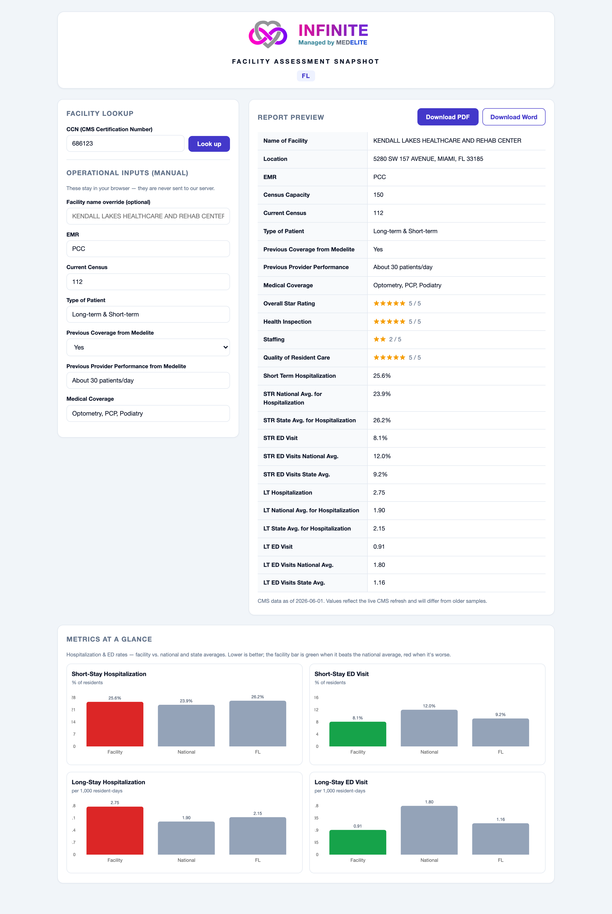

# Facility Assessment Report Generator

A lightweight micro‑app for evaluating skilled nursing facilities. Enter a facility's **CCN** (CMS
Certification Number); the app pulls public CMS data, combines it with manual operational inputs, and
produces a polished, print‑ready report (PDF **and** Word) branded for the *INFINITE — Managed by MEDELITE*
platform.

- **Live app:** **https://medelite-facility-assessment-eight.vercel.app**
- **Test facility:** CCN `686123` — Kendall Lakes Healthcare and Rehab Center, Miami FL



> **A note on the numbers:** CMS refreshes this dataset roughly monthly, so the live values will differ from
> the original sample report. That is expected — the app always shows current CMS data and stamps each
> report with the CMS "data as of" date. See [Assumptions](#assumptions--decisions).

---

## Contents

- [What it does](#what-it-does)
- [Quick start](#quick-start)
- [Architecture](#architecture)
- [Data sources & field mapping](#data-sources--field-mapping)
- [Security & privacy](#security--privacy)
- [Assumptions & decisions](#assumptions--decisions)
- [Difficulties & challenges](#difficulties--challenges)
- [Testing & QA](#testing--qa)
- [Tech stack](#tech-stack)
- [Project structure](#project-structure)

---

## What it does

### Core (MVP)
- **Dynamic CCN lookup** — enter any valid 6‑digit CCN to fetch that facility.
- **CMS data engine** — auto‑fills the official name, location, certified beds, and the four CMS star
  ratings from the public CMS Provider Data Catalog.
- **Facility‑name override** — defaults to the CMS legal name; an optional field overrides it on the report
  **body only** (never the brand banner).
- **Manual operational inputs** — EMR, Current Census, Type of Patient, Previous Coverage (Yes/No),
  Previous Provider Performance, and Medical Coverage.
- **One‑click PDF** — a single button generates and downloads a clean, print‑ready snapshot.
- **Clickable Medicare source link** — the export contains a real, clickable hyperlink to the facility's
  official Medicare *Care Compare* profile, built from the dynamic CCN.
- **Deployed** — a live Vercel URL and this public repository.

### Bonus features (all implemented)
- **The 12 hospitalization / ED metrics** — short‑stay (STR) and long‑stay (LT) measures, each with its
  national and state averages, with correct units (percent for short‑stay, rate per 1,000 resident‑days for
  long‑stay), suppressed/footnoted scores rendered as **N/A**, state averages keyed to the facility's own
  state, and a non‑blocking fetch (`Promise.allSettled`) so the bonus data can never gate the core report.
- **Word (.docx) export** — a second button produces an editable Word document with the same branding,
  table, and a real external Medicare hyperlink.
- **Charts / data cards** (Recharts) — a "Metrics at a Glance" panel comparing each measure to the national
  and state averages, with the facility bar colored green/red by whether it beats the national average
  (lower is better for these measures). On‑screen only; the documents stay clean tabular snapshots.
- **Advanced error handling** — invalid/empty CCNs return a clean state, missing facilities a clear
  not‑found message, and suppressed or null fields render gracefully instead of crashing.
- **High‑fidelity branding** — the INFINITE logo lockup (icon + gradient wordmark) on the web header and
  embedded into both exports.

## Quick start

```bash
npm install
npm run dev                      # http://localhost:3000
npm run build && npm run start   # production build (strict CSP active)
```

No environment variables or API keys are required — the CMS Provider Data API is public and keyless.

## Architecture

```
Browser  ──  React UI  ·  client‑side PDF & DOCX generation
   │
   │  GET /api/facility/[ccn]      ← only the public CCN ever leaves the browser
   ▼
Next.js Route Handler (server‑side proxy)
   │  validate CCN → fetch → normalize → return one typed object
   ▼
CMS Provider Data Catalog API  (data.cms.gov)
```

Two decisions define the architecture:

- **Server‑side proxy (`/api/facility/[ccn]`).** The CMS API does **not** return CORS headers, so a
  browser‑direct call is blocked in production. A thin Next.js Route Handler fetches server‑to‑server
  (CORS‑exempt), validates the CCN, normalizes the data, and returns a single typed object. It also fetches
  the bonus claims/averages datasets in parallel and degrades gracefully if they're unavailable.
- **Client‑side document generation.** The PDF (`@react-pdf/renderer`) and Word doc (`docx`) are assembled
  **in the browser**, so the confidential manual inputs never reach the server. Both emit real, selectable
  text and a genuine clickable link annotation — not a rasterized screenshot.

## Data sources & field mapping

All data comes from the **CMS Provider Data Catalog** datastore query API:
`https://data.cms.gov/provider-data/api/1/datastore/query/{datasetId}/0`, filtered on
`cms_certification_number_ccn`.

| Dataset | ID | Supplies |
| --- | --- | --- |
| **Provider Information** | `4pq5-n9py` | name, address, `number_of_certified_beds`, the 4 star ratings, state — the core report |
| **Medicare Claims Quality Measures** | `ijh5-nb2v` | the facility's 4 hospitalization/ED measures (codes 521/522/551/552) |
| **State / US Averages** | `xcdc-v8bm` | the `NATION` row + the facility's state row → the 8 national/state averages |

**Field mapping**

| Report line | Source |
| --- | --- |
| Name of Facility | `provider_name` (override wins, body only) |
| Location | composed from `provider_address` + `citytown` + `state` |
| Census Capacity | `number_of_certified_beds` |
| Overall / Health Inspection / Staffing / Quality of Resident Care | `overall_rating` / `health_inspection_rating` / `staffing_rating` / `qm_rating` |
| EMR, Current Census, Type of Patient, Previous Coverage, Previous Provider Performance, Medical Coverage | manual input |
| 12 hospitalization/ED lines | claims (`ijh5-nb2v`) + averages (`xcdc-v8bm`) |

The 12 metrics are joined on the stable `measure_code` (not on label text, which CMS rewords between
refreshes). Short‑stay measures (521/522) render as **percentages**; long‑stay measures (551/552) render as
**rates per 1,000 resident‑days** — they are not percentages.

## Security & privacy

This app handles **public** CMS data plus **confidential business** inputs. There is **no PHI and no personal
data**, so the governing concern is commercial confidentiality, addressed by architecture rather than
compliance machinery:

- **Data minimization** — only the public CCN is sent to the server. The manual inputs never leave the
  browser (documents are generated client‑side), so they are never logged, cached, or persisted anywhere.
- **Stateless** — no database, no server‑side storage of any request or input.
- **Hardened proxy** — the CCN is validated against a strict `^[0-9]{6}$` allowlist before any outbound
  call; the upstream host, dataset IDs, query property, and operator are fixed server constants (no SSRF /
  open‑relay surface); the CCN is passed only as an encoded query value, never into the URL path; upstream
  errors return generic messages with no internals; responses are cached only on a successful, populated 200.
- **Untrusted‑input handling** — CMS numerics arrive as strings and are coerced with empty/null guards (an
  empty string becomes `null`, never `0`); star ratings are clamped to 1–5 or shown as "Not Rated";
  suppressed/footnoted measures render "N/A"; an unknown CCN returns a clean not‑found.
- **Strict Content‑Security‑Policy** — production uses a nonce‑based policy with
  `script-src 'self' 'nonce-…' 'strict-dynamic' 'wasm-unsafe-eval'` (no `unsafe-inline` on scripts), plus
  `worker-src 'self' blob:`, `connect-src 'self' data:`, `object-src 'none'`, `frame-ancestors 'none'`, and
  the static headers `X-Frame-Options: DENY`, `X-Content-Type-Options: nosniff`, `Referrer-Policy`,
  `Permissions-Policy`, and HSTS.
- **No secrets** — the CMS API is keyless, so the app holds no upstream secret, and nothing sensitive is
  committed to this public repo.

## Assumptions & decisions

- **The sample report is a layout reference, not a values reference.** CMS refreshes monthly; the live
  figures for `686123` already differ from the sample. The app drives every value from the live API and
  stamps each report with the CMS "data as of" date.
- **Current Census is a manual input.** The brief's field‑mapping table lists it as manual; the CMS
  "average residents per day" is offered only as a placeholder hint.
- **The Medicare link uses the base detail URL** `…/care-compare/details/nursing-home/{CCN}` (verified to
  resolve). The sample's `…/view-all?state=FL` suffix is just an in‑app state filter and is omitted.
- **Clean labels follow the brief, not the sample's typos** (e.g. the sample's "STR State National Avg."
  conflates state and national; the brief separates them).
- **No authentication / no database** — the app reads only public data and persists nothing, so auth would
  protect nothing here. It would become warranted the moment reports or inputs were persisted.

## Difficulties & challenges

The trickiest problems came from running **production‑grade security alongside client‑side libraries**, and
from treating government data defensively. Each was diagnosed by testing and fixed deliberately.

1. **CMS sends no CORS headers (architecture‑shaping).** A browser‑direct fetch to `data.cms.gov` works in
   local testing but is blocked by the browser in production. Confirmed by inspecting the response (no
   `Access-Control-Allow-Origin`, even on the preflight). This is what drove the **server‑side proxy**;
   server‑to‑server requests are CORS‑exempt.

2. **The strict CSP broke React hydration in production — the hardest bug.** With the nonce‑based policy the
   deployed page rendered but was completely non‑interactive, while everything worked in `dev`. The API was
   healthy, so it was clearly client‑side. Inspecting the production HTML showed that **none** of the script
   tags carried the per‑request nonce, and because the policy uses `strict-dynamic` (which makes the browser
   ignore `'self'`), every script was being blocked, so React never hydrated. Root cause: the page was being
   **statically prerendered at build time**, while the nonce is generated **per request** in middleware — the
   two never met. Fix: force per‑request rendering (`export const dynamic = "force-dynamic"`), after which all
   scripts were nonced and hydration worked. Verified by re‑running the full browser test suite against the
   production build.

3. **`@react-pdf/renderer` vs. the CSP — twice.** The PDF library loads its WebAssembly layout engine from a
   `data:` URL (blocked by `connect-src`) and needs WASM to compile (blocked by the strict `script-src`); it
   initially limped along on a noisy JS fallback. Later, embedding the logo PNG made it spawn a **Web Worker
   from a `blob:` URL**, which the policy also blocked, and the PDF download silently failed. The console
   CSP‑violation messages pointed straight at each cause. Rather than weaken the whole policy, the compromise
   was to add **narrowly scoped** directives — `connect-src data:`, `script-src 'wasm-unsafe-eval'`, and
   `worker-src 'self' blob:` — so the library works while general script execution stays locked down.

4. **Word table columns collapsed.** The `.docx` export initially used percentage column widths, which Word
   collapses — every value wrapped one character per line. The text assertions passed (the content was all
   there), so this was only caught by **rendering the document and looking at it**. Fixed with a fixed table
   layout and explicit column widths in twips against the A4 usable width.

5. **The sample's numbers don't match live data.** Querying the live API for the sample CCN returned
   different beds and star ratings, because CMS had refreshed since the sample was produced. Recognizing the
   sample as a layout‑only reference (and stamping the "data as of" date) avoided hard‑coding stale values.

6. **Unguessable CMS column names.** Two of the four State‑Averages columns carry datastore‑generated hash
   suffixes (e.g. `…_1d02`, `…_d911`, `…_de9d`) that cannot be reproduced by slugifying the human label. The
   fix was to hard‑code the exact verified names and assert their presence, so a re‑publish that changes them
   fails loudly instead of silently emitting blanks.

7. **The provided logo was only the icon.** The uploaded asset was the heart‑infinity mark, not the full
   lockup, so the `INFINITE — Managed by MEDELITE` wordmark was recreated next to it (a CSS gradient on the
   web; solid brand colors in the PDF/Word, since gradients aren't supported there).

## Testing & QA

The app was validated with a headless‑browser end‑to‑end harness (puppeteer‑core driving Chrome), run
against both local builds and the live deployment:

- **Data correctness** — the app's normalized output is diffed against direct live CMS queries for the test
  CCN and a second out‑of‑state CCN; all 12 metric values match the live data exactly (within `1e-6`).
- **Branding guardrail** — the facility name (and any override) updates the report body but never the brand
  banner, on the web header and in both exports.
- **Privacy invariant** — request interception confirms the manual inputs are never sent over the network.
- **Exports** — the generated PDF and DOCX are unzipped/parsed to confirm the embedded logo, the 25 rows,
  correct units, and a real clickable Medicare link annotation.
- **Resilience** — invalid CCNs (`abc`, wrong length), an unknown CCN, a suppressed‑measure facility, and a
  null‑rating facility all render cleanly.

## Tech stack

| Area | Choice |
| --- | --- |
| Framework | Next.js (App Router), React, TypeScript |
| Hosting | Vercel |
| PDF | `@react-pdf/renderer` (client‑side) |
| Word | `docx` (client‑side) |
| Charts | Recharts |
| Security | nonce‑based CSP via middleware |
| Testing | puppeteer‑core (E2E, dev only) |

## Project structure

```
app/
  layout.tsx               root layout (force-dynamic so the CSP nonce reaches scripts)
  page.tsx                 the interactive UI (form, preview, export buttons)
  globals.css              styles, incl. the gradient logo lockup
  api/facility/[ccn]/route.ts   server-side proxy + data engine entrypoint
components/
  BrandHeader.tsx          fixed INFINITE logo lockup (never receives facility data)
  MetricsCharts.tsx        the "Metrics at a Glance" Recharts cards
lib/
  ccn.ts                   CCN validation (shared client/server)
  cms.ts                   fetch + normalize provider info, claims, and state averages
  metrics.ts               12-metric labels, units, and the value formatter
  report.ts                shared row builder so PDF and DOCX never drift
  pdf.tsx                  client-side PDF document
  docx.ts                  client-side Word document
  branding.ts              brand constants + input length caps
  logo.ts                  base64 logo (inlined for the exports)
middleware.ts              per-request nonce Content-Security-Policy
public/medelite-logo.png   the INFINITE icon (served to the web header)
```
